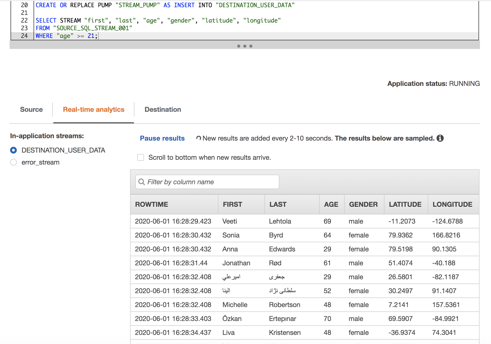
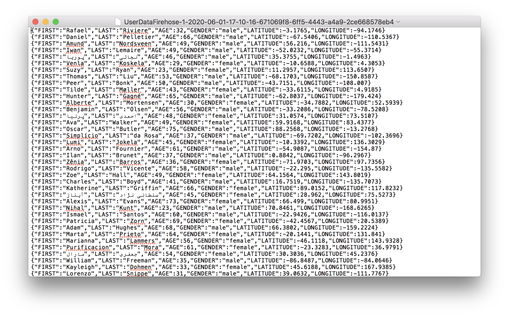

# Streaming and processing data using AWS Kinesis and AWS CloudFormation

A data stream called `UserData` consists of 1 shard. It consumes data records, which consist of data and partition key.

CloudFormation stack `UserDataStack` consists of:
- LnDataProducerRole
- LnInstanceProfiler
- LnKinesisPolicy
- LnDataProducerInstance

Kinesis Data Analytics application `UserDataAnalytics` connected to Kinesis Data Stream `UserData`, pre-processing is disabled, schema was successfully discovered.
Data Analytics allows to use SQL queries to transform your data. Following query was created to retrieve desired data from streamed data records.
```
  
CREATE OR REPLACE STREAM "DESTINATION_USER_DATA" (
    first VARCHAR(16), 
    last VARCHAR(16), 
    age INTEGER, 
    gender VARCHAR(16), 
    latitude FLOAT, 
    longitude FLOAT
);
CREATE OR REPLACE PUMP "STREAM_PUMP" AS INSERT INTO "DESTINATION_USER_DATA"

SELECT STREAM "first", "last", "age", "gender", "latitude", "longitude"
FROM "SOURCE_SQL_STREAM_001"
WHERE "age" >= 21;
```
The result of the query will be following:



In Kinesis Firehose create delivery stream with
destination: S3 bucket `kinesis-result`.

Kinesis Data Firehose buffers incoming records before delivering them to your S3 bucket. Record delivery will be triggered once either of these conditions has been satisfied:
Buffer size: 1MB
Buffer interval: 60 seconds.
Don't forget to create a role for firehose.
Also enable Lambda function, which will simply adds a new line character in the end of each line.

The result will be located in s3 bucket:
